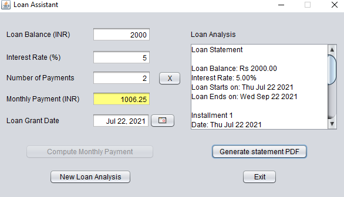
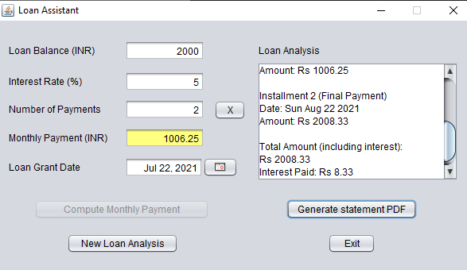
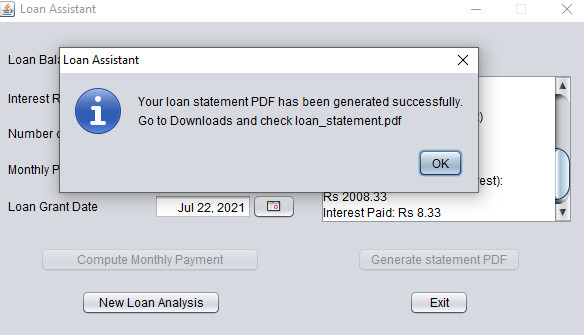

# Loan Assistant
Loan assistant application focuses on computing amount of monthly installments or number of installments as per the input given by the user. On entering loan balance amount,interest rate, user will have two options i.e. 
1. enter number of installments and loan assistant computes the amount of monthly installments. 
  
  
2. or enter monthly payment and the loan assistant computes the number of installments.  
  
Users have the flexibilty to choose loan grant date accordingly.  
The loan assitant also gives the brief summary of the loan amount being granted in the loan analysis field.  
  
  
Moreover, a user can also generate detailed loan statement that includes all information about the monthly installments along with their due dates and a transaction summary at the end.  
  
  
A user can click on ***New Loan Analysis*** to compute and generate new loan statement.  

There is also an option to generate ***PDF*** of the whole loan statement which will be saved by default in user's Downloads folder.  
  
For the purpose of PDF creation, ***iText Api*** is used which is a powerful open-source Java library that deals with PDFs. 
Documentation can be found [here](https://itextpdf.com/en/resources/api-documentation).
